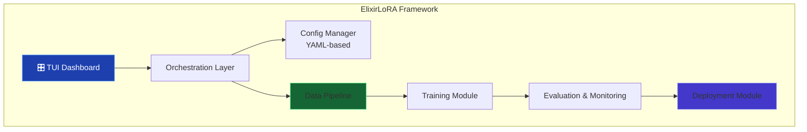
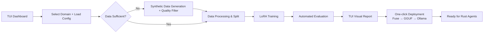

# ElixirLoRA System Design Document

**Version:** 1.0  
**Date:** June 25, 2026  
**Project Name:** ElixirLoRA  
**Goal:** A reusable, automated "Model Alchemy Factory" for domain-specific LoRA fine-tuning on Apple Silicon.

---

## 1. Overview

**ElixirLoRA** is a personal model fine-tuning framework optimized for MacBook (M3 36GB) that allows efficient creation and management of domain-specific small models (3B–7B).

**Core Philosophy:**
- Avoid one-off work — everything should be configurable and reusable.
- Deep integration of synthetic data generation.
- Rich TUI (Text User Interface) for intuitive control.
- Seamless transition from training to deployment for Rust agents.

**Base Foundation:** Fork of [`fine-tune-llm`](https://github.com/DidierRLopes/fine-tune-llm)

---

## 2. High-Level Architecture

## 3\. Key Components

### 3.1 TUI Dashboard (Top Layer)

**Entry Point:** dashboard.py or run\_pipeline.py --tui

**Features:**

-   Domain selection (code\_review, architecture, etc.)
-   Configuration preview and light editing
-   One-click "Run Full Pipeline"
-   Real-time progress tracking(training, data generation, evaluation)
-   Tabbed panels:
    -   Overview
    -   Synthetic Data
    -   Training & Logs
    -   Evaluation Report
    -   Deployment & Adapters
-   Rich visualizations using Rich + Textual (progress bars, tables, sparklines, comparisons views)
-   Adapter management panel

### 3.2 Orchestration Layer

-   Unified entry point for both CLI and TUI.
-   Command example: python run\_pipeline.py --domain code\_review --config configs/code\_review.yaml --tui
-   Coordinates the full workflow, handles resume, logging, and error recovery.

### 3.3 Data Pipeline (Core Advantage)

Fully integrated **synthetic data generation** as a first-class module.

**Features:**

-   Automatic check whether existing data is sufficient.
-   **Synthetic Data Generator** (src/data/synthetic\_generator.py):
    -   Uses seed examples (10–100 samples)
    -   Calls strong teacher models (Grok, Claude, etc.)
    -   Supports Few-shot, CoT, Self-Refine, Critique-Revise
    -   Structured JSON output with Pydantic
    -   Quality filtering, deduplication, diversity control
-   Data processing: formatting, splitting, chat template application
-   Supports iterative self-improvement loops

### 3.4 Training Module

-   Based on fine-tune-llm \+ MLX ecosystem (mlx-lm, mlx-tune)
-   Optimized for LoRA / QLoRA on 36GB Mac
-   Memory-friendly configurations
-   Resume training support
-   YAML-driven hyperparameters

### 3.5 Evaluation & Monitoring

-   Automatic evaluation after training
-   Supported metrics:
    -   Perplexity + Loss curves
    -   LLM-as-Judge (win rate + detailed comparisons)
    -   BERTScore / ROUGE
    -   Manual sample review
-   Rich TUI reports with tables and plots
-   Base model vs. fine-tuned model comparison
-   Automatic Markdown + JSON report generation

### 3.6 Deployment Module

-   One-click actions in TUI:
    -   Fuse LoRA adapter
    -   Export to GGUF (multiple quantization levels)
    -   Create / update Ollama model
-   **Multi-adapter Support** (planned):
    -   One base model + multiple domain adapters
    -   Adapter manager panel for enabling/disabling/switching
    -   Efficient serving with Ollama / llama.cpp

* * *

## 4\. End-to-End Workflow

## 5\. Technology Stack

-   **Core:** Python + MLX (mlx-lm, mlx-tune)
-   **Base Project:** fine-tune-llm
-   **TUI:** Rich + Textual
-   **CLI:** Typer / Click
-   **Data:** datasets, Pydantic, JSONL
-   **Deployment:** llama.cpp + Ollama
-   **Experiment Tracking:** Local JSON logs + optional MLflow

* * *

## 6\. Future Enhancements

-   Full multi-adapter runtime switching
-   Advanced self-improvement loops
-   Optional web UI
-   Cloud training offload support

* * *

**This document defines the blueprint for ElixirLoRA.** Development will proceed incrementally, starting with forking the base repository and implementing the synthetic data module + TUI.
