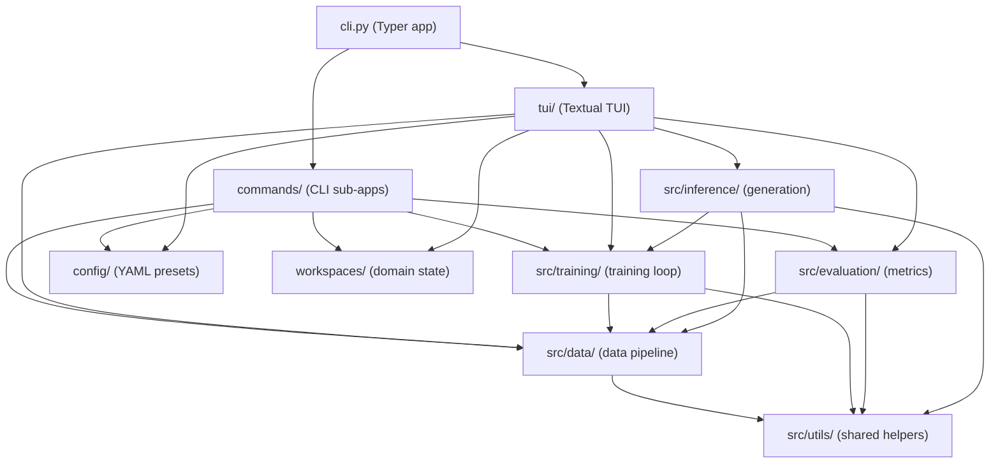

# ElixirTune: Internal Architecture Wiki

ElixirTune is a Python-based ML training and fine-tuning toolkit built on MLX, providing a synthetic data pipeline, multi-mode training (SFT, DPO, embedding), evaluation, and a rich terminal UI. The project follows a flat command-line interface powered by Typer, with a modular internal source tree (`src/`) that separates data processing, training, evaluation, and inference into cohesive units.

The system has two primary entry points: the CLI (`cli.py`) for batch operations like generate, prepare, train, evaluate, and export, and the TUI (`tui/app.py`) for interactive domain management, real-time training monitoring, and GGUF export. Configuration flows from YAML presets and defaults through workspace-scoped overrides, feeding both CLI commands and TUI panels with runtime-ready settings.

> **Audience:** developers **of** ElixirTune itself. Consumer-facing
> documentation (READMEs, tutorials, API docs) lives elsewhere and is not
> duplicated here.

## System Map

## Page Index

| Page | Covers | Summary |
|------|--------|---------|
| [data](data.md) | `src/data/` | Synthetic data pipeline: data generation, loading, filtering, and preprocessing |
| [training](training.md) | `src/training/` | MLX-based training loop: optimization, LoRA, metrics writing |
| [evaluation](evaluation.md) | `src/evaluation/` | Evaluation metrics calculator and pipelines |
| [inference](inference.md) | `src/inference/` | Text generation and inference utilities |
| [cli-commands](cli-commands.md) | `commands/` | CLI sub-apps: init, generate, prepare, train, evaluate, export, chat, etc. |
| [tui](tui.md) | `tui/` | Textual-based TUI: app shell, panels, widgets, domain management, GGUF export modal |
| [config](config.md) | `config/` | Configuration management: defaults, presets, model/training/evaluation configs |
| [workspaces](workspaces.md) | `workspaces/` | Workspace domain state and path resolution |

## Maintenance Convention

Every page ends with a **Source Anchors** section listing the paths it
documents. **Rule:** a PR that changes files under a page's anchors either
updates the page or says why not in the PR body. Drift is detectable
mechanically: `git log <last-commit-touching-page>.. -- <anchors>` lists
pages whose sources moved without them; the `generate-wiki` skill's
`refresh` mode automates this. There is deliberately no CI freshness gate:
gates train contributors to make no-op doc edits. Run the materialized
`check-wiki.sh` (in `scripts/` or alongside this file) to verify
structural conventions.

## Page Conventions

Copy [TEMPLATE.md](TEMPLATE.md) for new pages: eight sections in order;
Mermaid-only diagrams; no line numbers (function/type/file names only);
links target only canonical page filenames; every Key Decision cites a real
PR number or commit SHA; known debt appears only under Implementation
Notes. Target 150–350 lines per page; if a draft exceeds ~400 lines it is
over-scoped.
