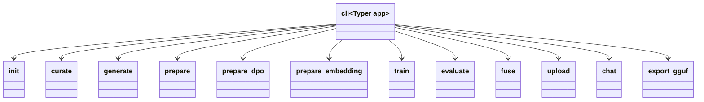

# CLI Commands

## Purpose

The CLI provides a command-line interface to ElixirTune's full pipeline via **Typer**. It has two entry points: `cli.py` (the main application) and `cli.py tui` (launches the TUI). The CLI is organized as a flat set of sub-commands, each wrapping an `src/` module for a specific pipeline stage. Commands operate on a workspace-per-domain model, deriving paths from the domain name rather than requiring explicit path arguments.

## Position in the System

Consumed by:
- **External users** — direct CLI invocation (`elixirtune train code_review --method sft ...`)
- **[tui](tui.md)** — panels invoke CLI commands as subprocesses

Consumes:
- **[data](data.md)** — data pipeline stages (generate, prepare, prepare-dpo, prepare-embedding)
- **[training](training.md)** — SFT, DPO, embedding, cross-encoder, GRPO training
- **[evaluation](evaluation.md)** — model evaluation
- **[config](config.md)** — config file paths and presets

## Architecture

The CLI is a flat Typer app — no sub-groups, no hierarchical nesting. Each command is a separate module under `commands/`, imported and mounted in `cli.py`. All commands share a common pattern:

1. Import `_ws()` from `commands/__init__.py` to resolve the workspace path
2. Accept `domain` as the primary argument
3. Load configs from the workspace or global defaults
4. Delegate to the appropriate `src/` module

**Command modules:**

| Module | CLI command | Delegates to | Purpose |
|--------|------------|--------------|---------|
| `commands/init.py` | `init <domain>` | `data.synthetic.io` | Create workspace, import or bootstrap seeds |
| `commands/curate.py` | `curate <domain>` | — | Human curation of seed examples (TUI only) |
| `commands/generate.py` | `generate <domain>` | `data.synthetic.pipeline.run_generate` | Run synthetic data generation pipeline |
| `commands/prepare.py` | `prepare <domain>` | `data.preprocessor.DataPreprocessor` | Convert JSONL to train/val/test splits |
| `commands/prepare_dpo.py` | `prepare-dpo <domain>` | `data.dpo.pipeline.run_prepare_dpo` | Build DPO preference pairs |
| `commands/prepare_embedding.py` | `prepare-embedding <domain>` | — | Import or convert data for embedding training |
| `commands/train.py` | `train <domain>` | `src.training.{sft,dpo,embedding,grpo,cross_encoder}` | Fine-tune with specified method |
| `commands/evaluate.py` | `evaluate <domain>` | `evaluation.evaluator`, `evaluation.embedding_evaluator` | Evaluate trained model |
| `commands/fuse.py` | `fuse <domain>` | — | Fuse LoRA adapters into base model |
| `commands/upload.py` | `upload <domain>` | — | Upload fused model to HuggingFace |
| `commands/chat.py` | `chat <domain>` | `inference.generator` | Interactive chat with trained model |
| `commands/export_gguf.py` | `export-gguf <domain>` | — | Export model to GGUF format |

## Runtime Flows

1. **Domain init + data pipeline:**
   1. `init <domain>` — create workspace directory, write `config.yaml` and `description.txt`
   2. `curate <domain>` — review/edit/approve seed examples (implemented via TUI)
   3. `generate <domain>` — run `pipeline.run_generate()` with teacher, embedder, filters
   4. `prepare <domain>` — convert `generated/filtered.jsonl` + `seeds/approved.jsonl` to train/val/test splits via `DataPreprocessor`

2. **Training pipeline:**
   1. `train <domain> --method sft` — SFT training via `mlx_tune.SFTTrainer`
   2. (Optional) `fuse <domain>` — fuse LoRA adapters into base model
   3. `train <domain> --method dpo` — DPO training (continues from fused model)
   4. `train <domain> --method embedding` — embedding fine-tuning

3. **Evaluation pipeline:**
   1. `evaluate <domain> --method lm` — LM evaluation (BERTScore + word overlap)
   2. `evaluate <domain> --method embedding` — embedding evaluation (Recall@K, BEIR)

## Key Decisions

### Flat Typer sub-commands (no grouping)
- **Decision:** All commands are mounted directly on the main Typer app — no sub-groups or hierarchical nesting.
- **Context:** The project has ~12 commands, all at the same conceptual level (pipeline stages). Grouping would add cognitive overhead without organizational benefit.
- **Alternatives rejected:** Grouping by pipeline phase (data/train/eval) — would add command namespacing (`elixirtune data generate`) but not help with discoverability since each command is already self-descriptive.
- **Consequences:** The command help is a flat list; users type `elixirtune <command>` for all operations.
- **Ref:** 2026-06-26, Training Backend Refactor Design Spec §Architecture

### Workspace-per-domain path resolution
- **Decision:** All commands resolve workspace paths via `_ws(domain)` rather than requiring explicit path arguments.
- **Context:** The project uses one directory per domain (`workspaces/{domain}/`), and the workspace layout is consistent. Hardcoding the path resolution in `_ws()` eliminates repetition.
- **Alternatives rejected:** Passing workspace paths as CLI arguments (verbose, error-prone); using environment variables (opaque, hard to debug).
- **Consequences:** Commands are concise (`elixirtune train code_review`) but the workspace layout must be consistent. Non-standard workspace layouts are not supported.
- **Ref:** 2026-06-26, Training Backend Refactor Design Spec

### Method dispatch pattern in train command
- **Decision:** `commands/train.py` uses a single command with a `--method` option that dispatches to the appropriate training module via `if/elif`.
- **Context:** All training methods share the same argument signature (domain, model config, training config, train data, val data). Grouping them as sub-commands would duplicate argument definitions.
- **Alternatives rejected:** Separate Typer apps per method (duplicates argument definitions); separate CLI commands (too many commands).
- **Consequences:** Adding a new training method requires adding one `elif` branch and a new `src/training/` module. The dispatch is simple but not extensible (no plugin system).
- **Ref:** 2026-06-26, Training Backend Refactor Design Spec §commands/train.py

### Prepare combines seeds with generated data
- **Decision:** The `prepare` command includes both curated seeds and generated data in the final train/val/test splits, deduplicating by conversation content.
- **Context:** Seeds are high-quality but limited in number; generated data adds volume but may include lower-quality examples. Combining them maximizes dataset size while keeping the highest-quality seeds.
- **Alternatives rejected:** Using only generated data (loses seed quality); using only seeds (too small for training).
- **Consequences:** The prepare command is the final gate before training — it produces the actual training data that the fork's preprocessor consumes.
- **Ref:** 2026-06-29, commit c73197b

## Implementation Notes

- **`commands/curate.py` is a no-op in CLI:** The curation step (reviewing/editing/approving seeds) is implemented as a TUI screen, not a CLI command. The CLI module exists but is a stub.
- **`commands/__init__.py` contains only `_ws()`:** The workspace path resolver is the sole shared utility in the commands package. It's a simple one-liner: `Path("workspaces") / domain`.
- **Sys path manipulation:** Each command module manipulates `sys.path` to include the project root and `src/` directory, allowing imports like `from data.synthetic.pipeline import run_generate`. This is a workaround for the flat directory layout (no `src/` package `__init__.py` for top-level imports).
- **No PR or design doc records a rationale for the sys.path manipulation pattern in each command; observed current state: each command module inserts the project root and src/ into sys.path at runtime, which is a workaround for the flat directory layout.**
- **`prepare-embedding` exists as a CLI command but is not documented in the original design spec as a standalone CLI entry; the design spec covers the TUI panel for embedding data import/convert, and the CLI command was added to support non-TUI workflows.**

## Source Anchors

- `cli.py`
- `commands/__init__.py`
- `commands/init.py`
- `commands/curate.py`
- `commands/generate.py`
- `commands/prepare.py`
- `commands/prepare_dpo.py`
- `commands/prepare_embedding.py`
- `commands/train.py`
- `commands/evaluate.py`
- `commands/fuse.py`
- `commands/upload.py`
- `commands/chat.py`
- `commands/export_gguf.py`
- `docs/superpowers/specs/2026-06-26-training-backend-refactor-design.md`
- `docs/superpowers/specs/2026-06-30-elixirtune-embedding-rename-design.md`

## Related Pages

- [data](data.md)
- [training](training.md)
- [evaluation](evaluation.md)
- [inference](inference.md)
- [tui](tui.md)
- [config](config.md)
- [workspaces](workspaces.md)
