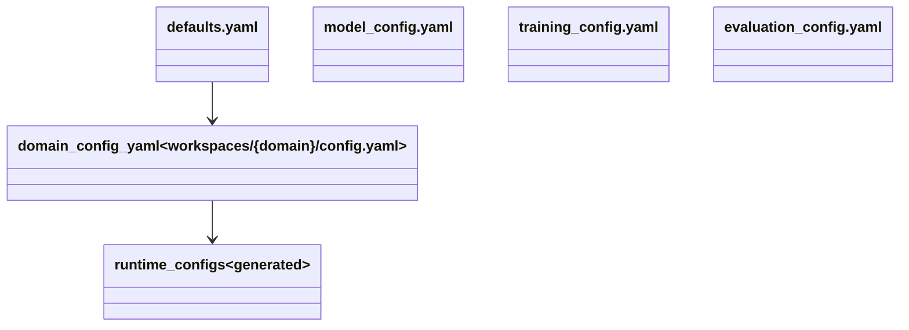

# Configuration

## Purpose

The configuration system provides a hierarchical YAML-based model with a **global defaults** layer and a **per-domain override** layer. The global defaults (`config/`) define every available knob with its default value, while per-domain configs (`workspaces/{domain}/config.yaml`) override only what differs. Runtime configs (`runtime_*.yaml`) are generated on-the-fly by the TUI by overlaying workspace-scoped paths on top of global defaults.

## Position in the System

Consumed by:
- **[data](data.md)** — `synthetic/config.py:load_config()` reads defaults + domain override
- **[training](training.md)** — `commands/train.py` reads `runtime_model_config.yaml` and `runtime_training_config.yaml`
- **[tui](tui.md)** — `generate_runtime_configs()` creates workspace-scoped runtime configs
- **[cli-commands](cli-commands.md)** — commands load runtime configs for model/training/evaluation settings

## Architecture

**File layout:**

| Path | Purpose |
|------|---------|
| `config/defaults.yaml` | Global defaults for the synthetic data pipeline (teacher, bootstrap, generate, refine, filter, DPO data) |
| `config/model_config.yaml` | Model config: base model path, LoRA params, embedding block, cross-encoder block |
| `config/training_config.yaml` | Training config: method, iterations, batch size, LR, DPO beta, embedding settings |
| `config/evaluation_config.yaml` | Evaluation config: method, max tokens, BERTScore settings, comparison thresholds |
| `workspaces/{domain}/config.yaml` | Domain-specific overrides (teacher URL, API key, generate target, etc.) |
| `workspaces/{domain}/runtime_model_config.yaml` | Generated: model config with workspace-scoped paths |
| `workspaces/{domain}/runtime_training_config.yaml` | Generated: training config with workspace-scoped paths |
| `workspaces/{domain}/runtime_eval_config.yaml` | Generated: evaluation config with workspace-scoped paths |

**Config loading:**

`synthetic/config.py:load_config()` implements `_deep_merge(base, override)`:
1. Load `config/defaults.yaml` as the base
2. If `workspaces/{domain}/config.yaml` exists, load it as override
3. Deep merge: recursively merge dicts; non-dict values in override replace base values
4. Return the merged config

**Runtime config generation:**

`tui/domain.py:generate_runtime_configs()` creates workspace-scoped runtime configs:
1. Read global config file (e.g., `config/model_config.yaml`)
2. Overlay workspace-scoped paths (adapter_dir, fused_model_dir, etc.)
3. Write to `workspaces/{domain}/runtime_model_config.yaml`
4. Repeat for training and evaluation configs

**Model config (`config/model_config.yaml`):**
- `base_model.path`: Base model for LM fine-tuning (`mlx-community/Qwen2.5-7B-Instruct-4bit`)
- `lora.*`: LoRA parameters (rank, scale, dropout, keys)
- `embedding.*`: Embedding fine-tuning settings (base model, pooling, LoRA)
- `cross_encoder.*`: Cross-encoder settings

**Training config (`config/training_config.yaml`):**
- `method`: Default training method (`sft`)
- `training.*`: Common training params (batch size, iterations, learning rate)
- `dpo.*`: DPO-specific (beta, from_base)
- `embedding.*`: Embedding training params (loss type, temperature, anchor/positive columns)

**Evaluation config (`config/evaluation_config.yaml`):**
- `evaluation.*`: Method, max tokens, temperature
- `metrics.*`: BERTScore model, word overlap threshold
- `comparison.*`: Score thresholds for excellent/good/acceptable/poor

## Runtime Flows

1. **Synthetic pipeline config loading:**
   1. `synthetic/config.py:load_config(domain)` is called
   2. Load `config/defaults.yaml`
   3. If `workspaces/{domain}/config.yaml` exists, load it
   4. Deep merge: domain override on top of defaults
   5. Return merged config dict

2. **Training config loading:**
   1. `commands/train.py` receives `--model-config` and `--training-config` paths
   2. Each is a runtime config file (generated by TUI or manually created)
   3. Loaded via `yaml.safe_load()` and passed to the training module
   4. Training module reads the appropriate blocks (e.g., `model.lora`, `training.training`)

3. **Runtime config generation:**
   1. TUI calls `generate_runtime_configs(ws)` before executing a command
   2. For each config type, reads global default, overlays workspace paths
   3. Writes `runtime_{model,training,eval}_config.yaml` to the workspace

## Key Decisions

### Global defaults as single source of truth
- **Decision:** `config/defaults.yaml` contains every knob with its default value. Domain configs override only what they need.
- **Context:** Users should not need to copy the entire config to change one knob. The defaults file documents every available option.
- **Alternatives rejected:** Separate default files per module (adds friction); no defaults (every domain config is complete).
- **Consequences:** Adding a new knob requires adding it to `defaults.yaml` and the config loader; domain configs that don't override it will use the default.
- **Ref:** 2026-06-25, Synthetic Data Pipeline Design Spec §9

### Runtime configs with workspace-scoped paths
- **Decision:** Workspace-scoped runtime configs (`runtime_model_config.yaml`, etc.) are generated by overlaying workspace paths on top of global defaults.
- **Context:** Global configs don't know about workspace paths (adapters dir, data paths, log dirs). Commands need these paths to function.
- **Alternatives rejected:** Hardcoding paths in commands (less flexible); passing paths as CLI arguments (clutters interface).
- **Consequences:** The TUI generates these files before each command run. Commands read from runtime configs, not global defaults.
- **Ref:** 2026-06-26, Training Backend Refactor Design Spec §Cleanup: fine-tune-llm leftovers

### Deep merge for config overrides
- **Decision:** Domain configs are deep-merged on top of defaults, not shallow-merged.
- **Context:** A domain config that overrides `teacher.base_url` should not lose the rest of the `teacher` block or other top-level keys.
- **Alternatives rejected:** Shallow merge (nested keys would be entirely overwritten); full config per domain (duplicates defaults).
- **Consequences:** `synthetic/config.py:_deep_merge()` and `tui/domain.py:_deep_merge_impl()` are identical functions — one is used by the data pipeline, the other by the TUI. This is a minor code duplication.
- **Ref:** 2026-06-25, Synthetic Data Pipeline Design Spec §9

### Config blocks by training method
- **Decision:** `config/training_config.yaml` contains method-specific blocks (`dpo.*`, `embedding.*`) alongside the common `training.*` block.
- **Context:** Different training methods have different parameters (DPO needs `beta`, embedding needs `loss_type`, `anchor_column`). Grouping them by method keeps the config organized.
- **Alternatives rejected:** Separate config files per method (adds file management complexity); flat config with method-specific keys at the top level (less organized).
- **Consequences:** The training module reads `cfg["training"]["dpo"]` or `cfg["training"]["embedding"]` depending on the method. The `method` field at the top level selects the active training paradigm.
- **Ref:** 2026-06-30, Embedding Rename Design Spec §3

## Implementation Notes

- **Deep merge duplication:** `_deep_merge()` exists in both `synthetic/config.py` and `tui/domain.py` with identical implementation. This is a minor code smell but has not been consolidated — likely because the modules should remain independently importable.
- **No PR or design doc records a rationale for keeping the deep merge functions duplicated; observed current state: `synthetic/config.py:_deep_merge()` and `tui/domain.py:_deep_merge_impl()` are identical functions in separate modules.**
- **Domain config YAML is optional:** If `workspaces/{domain}/config.yaml` does not exist, `load_config()` returns just the defaults. No error is raised.
- **Runtime configs are generated on demand:** They are not created during domain init; they are generated when the TUI needs them (before running a command). This means a domain can exist without runtime configs until a command is triggered.
- **Embedding and cross-encoder blocks in model_config.yaml:** These are added per the Embedding Rename Design Spec. Existing domains without these blocks will get empty configs when the overlay is applied (since the overlay reads from the global config which has these blocks).

## Source Anchors

- `config/defaults.yaml`
- `config/model_config.yaml`
- `config/training_config.yaml`
- `config/evaluation_config.yaml`
- `src/data/synthetic/config.py`
- `tui/domain.py`
- `docs/superpowers/specs/2026-06-25-synthetic-data-pipeline-design.md`
- `docs/superpowers/specs/2026-06-30-elixirtune-embedding-rename-design.md`

## Related Pages

- [data](data.md)
- [training](training.md)
- [cli-commands](cli-commands.md)
- [tui](tui.md)
- [workspaces](workspaces.md)
