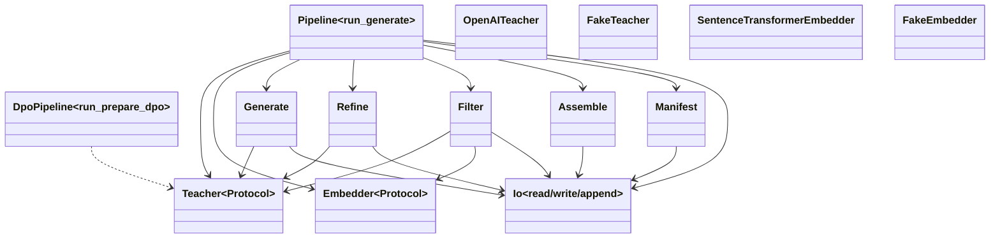

# Data Subsystem

## Purpose

The data subsystem manages the end-to-end lifecycle of training datasets for ElixirTune. Its core is the **synthetic data generation pipeline** — a series of stages that turn a domain description into quality-filtered training data using a teacher LLM. A secondary **DPO pipeline** produces preference pairs (chosen/rejected) from existing data for direct preference optimization. The subsystem also provides a **config model** that deep-merges domain-specific overrides on top of global defaults, and utilities for loading, preprocessing, and validating data.

## Position in the System

The data subsystem is consumed by:
- **[cli-commands](cli-commands.md)** — `commands/generate.py`, `commands/prepare.py`, `commands/prepare_dpo.py`, `commands/prepare_embedding.py` orchestrate pipeline stages as CLI commands
- **[tui](tui.md)** — TUI panels read workspace data to display status and trigger pipelines
- **[training](training.md)** — training commands consume `processed/` and `generated/` outputs

It consumes:
- **[config](config.md)** — `config/defaults.yaml` for teacher, bootstrap, generate, refine, and filter knobs
- External teacher LLM via OpenAI-compatible API

## Architecture

The pipeline is organized around a single orchestrator function `run_generate()` in `pipeline.py`. Each stage is a standalone function that reads from its input path, transforms records, and writes to its output path — making stages inspectable, resumable, and independently testable.

**Teacher abstraction:** `src/data/synthetic/teacher.py` defines a `Teacher` Protocol with a single `chat()` method. Two implementations exist: `OpenAITeacher` wraps the OpenAI SDK against any OpenAI-compatible endpoint (local `llama.cpp`, xAI/Grok, Together, etc.), and `FakeTeacher` provides deterministic canned responses for testing. Factory function `from_config()` reads `teacher.*` from the merged config.

**Embedder abstraction:** `src/data/synthetic/embedder.py` defines an `Embedder` Protocol with an `embed()` method. `SentenceTransformerEmbedder` uses `sentence-transformers` at runtime (lazy-loaded), while `FakeEmbedder` maps strings to pre-defined vectors. Used only by the `dedup` filter.

**Stage functions (all in `src/data/synthetic/`):**
- `bootstrap.py:bootstrap_seeds()` — generates starter seed examples from a domain description
- `generate.py:generate_batch()` — few-shot expansion with optional CoT and topic steering; `plan_topics()` generates diverse topics to prevent mode collapse
- `refine.py:apply_passes()` — ordered pipeline of `self_refine` and `critique_revise` passes (both toggleable)
- `filter.py` — four filters in order: `validate_schema()` (empty/length checks), `dedup()` (embedding similarity), `judge()` (teacher scores), `enforce_diversity()` (category quotas)
- `assemble.py:assemble()` — strips `meta` field, writes pure `conversation` records for the training fork
- `manifest.py:build_manifest()` — captures teacher config, seed hash, stage counts, judge distribution, git SHA
- `io.py` — JSONL read/write/append utilities and `make_record()` for creating the canonical record shape

## Runtime Flows

1. **Synthetic generation pipeline** (`pipeline.py:run_generate`):
   1. Read `seeds/approved.jsonl` (raises `CurationGateError` if absent)
   2. Plan diverse topics via `generate.py:plan_topics()` to steer generation
   3. Loop: call `generate.py:generate_batch()` with topic steering, append to `generated/raw.jsonl` (resume-aware: checks existing line count)
   4. Apply refinement passes via `refine.py:apply_passes()` → `generated/refined.jsonl`
   5. Filter sequentially: `validate_schema()` → `dedup()` → `judge()` → `enforce_diversity()`, collecting rejected records with reasons
   6. Write `generated/filtered.jsonl` via `assemble.py:assemble()` (strips `meta`)
   7. Write `runs/<timestamp>/` with manifest, rejected records, and stats

2. **DPO preference preparation** (`dpo/pipeline.py:run_prepare_dpo`):
   1. `collect_prompts()` reads approved seeds and filtered data, dedupes by prompt text
   2. `gather_candidates()` is injected (callable parameter) to produce candidate answers per prompt
   3. `pair_candidates()` scores candidates via injected `judge_fn`, keeps pairs where score gap >= `min_margin`
   4. Writes `processed/dpo.json` with `{prompt, chosen, rejected}` triples

3. **Embedding data preparation** (`commands/prepare_embedding.py`):
   1. **Import mode:** reads user-provided JSON/JSONL, validates columns against config, splits train/val → `processed/embedding_train.json` + `embedding_val.json`
   2. **Convert mode:** reads `seeds/approved.jsonl` / `generated/filtered.jsonl`, converts Q&A pairs (question→anchor, answer→positive), randomly draws negatives for triplet loss

## Key Decisions

### Teacher abstraction via OpenAI-compatible API
- **Decision:** All teacher interaction flows through a single OpenAI-compatible `Chat Completions` client, with no per-provider SDKs.
- **Context:** The project needed a local-first dev experience (llama.cpp + Qwen3.6) and a production path to any provider.
- **Alternatives rejected:** Per-provider SDKs (OpenAI, Anthropic, xAI, etc.) — would multiply maintenance burden and the OpenAI-compatible API is the universal abstraction.
- **Consequences:** Anthropic Claude works only via its OpenAI-compatibility endpoint; the design doc notes this as a config awareness, not a blocker.
- **Ref:** 2026-06-25, Synthetic Data Pipeline Design Spec §3

### Filtering as the highest-value stage
- **Decision:** The four filters (schema, dedup, judge, diversity) run in order from cheapest/deterministic to most expensive, and refinement loops default off.
- **Context:** The design doc identifies filtering as the "highest-value stage" — refinement loops multiply teacher calls without a guaranteed quality gain.
- **Alternatives rejected:** Always-on refinement passes; expensive filters before cheap ones.
- **Consequences:** All refinement strategies are available day one but toggleable; the filter order ensures early rejections are cheap.
- **Ref:** 2026-06-25, Synthetic Data Pipeline Design Spec §5-6

### Workspace directory layout with stage-persisted outputs
- **Decision:** Each pipeline stage writes its output to disk before the next stage reads it, creating an inspectable, resumable pipeline.
- **Context:** The fork's data module expects a specific JSON format; the pipeline needs to produce that format as its final output. Between stages, internal metadata-carrying records are needed for filtering and traceability.
- **Alternatives rejected:** In-memory-only pipeline (not inspectable/resumable); separate format per stage (adds complexity).
- **Consequences:** Workspace directories grow with intermediate files; but each stage is idempotent on its inputs, enabling safe retries.
- **Ref:** 2026-06-25, Synthetic Data Pipeline Design Spec §4

### Run manifest for traceability
- **Decision:** Each `generate` run writes a local JSON manifest capturing resolved config, teacher identity, seed-set hash, stage counts, judge distribution, and git SHA.
- **Context:** The fork provides no run tracking — only a `logs/` folder and YAML configs. Generation provenance is "structurally ours."
- **Alternatives rejected:** External tracking (MLflow/W&B) — deferred per YAGNI; local JSON mirrors the fork's lightweight ethos while adding reproducibility.
- **Consequences:** Datasets are reproducible from the manifest alone (same config + seeds + git SHA → same teacher calls).
- **Ref:** 2026-06-25, Synthetic Data Pipeline Design Spec §8; PR #1 (bf90201)

### Deep-merge config model
- **Decision:** `config/defaults.yaml` is the single source of truth with all knobs exposed; domain `config.yaml` overrides only what it needs via deep merge.
- **Context:** Users should not need to copy the entire config to change one knob; the loader must handle missing domain configs gracefully.
- **Alternatives rejected:** Shallow merge (nested keys would be overwritten entirely); separate default files per module (adds friction).
- **Consequences:** `synthetic/config.py:load_config()` implements `_deep_merge()` recursively; a missing domain config simply returns the defaults.
- **Ref:** 2026-06-25, Synthetic Data Pipeline Design Spec §9

### DPO pipeline with injected candidate sources
- **Decision:** `run_prepare_dpo()` accepts `gather_candidates()` and `judge_fn` as injected callables, making the pipeline backend-agnostic and testable.
- **Context:** DPO needs candidate answers from multiple sources (teacher, SFT model, base model) and a judge to score them. Different users may want different candidate sources.
- **Alternatives rejected:** Hardcoded candidate sources (limits flexibility); separate pipeline per candidate source (duplicates logic).
- **Consequences:** The DPO pipeline is fully testable with fake candidate generators and judges; production code injects real model-based gatherers.
- **Ref:** 2026-06-30, commit 0f2577e

### Embedding domain type system
- **Decision:** Each domain's `config.yaml` gains a `type` field (`lm` or `embedding`), with embedding domains having a separate status ladder and data format.
- **Context:** Embedding fine-tuning requires different data formats (anchor/positive/negative triples), different training loops, and a different evaluation pipeline.
- **Alternatives rejected:** Single domain type with conditional logic everywhere; separate repo per domain type.
- **Consequences:** The TUI and commands branch on domain type; existing domains default to `lm` (backward compatible).
- **Ref:** 2026-06-30, Embedding Rename Design Spec §2

## Implementation Notes

- **Legacy loader/preprocessor/validator:** `src/data/loader.py` (`DataLoader`), `src/data/preprocessor.py` (`DataPreprocessor`), and `src/data/validator.py` (`DataValidator`) appear to be inherited from the original `fine-tune-llm` project. They use HuggingFace `datasets` loading, Phi-3 chat formatting (`<|system|>`, `<|user|>`, `<|assistant|>`, `<|end|>`), and a `data/processed/` output path — none of which align with the workspace-per-domain model or the synthetic pipeline's JSONL format. These classes are imported by `src/_compat.py` but do not participate in the CLI command flow. They should be treated as **legacy/dead code** unless explicitly wired by a future command.
- **Record shape:** Internal records carry a `meta` dict alongside `conversation`. The `meta` dict includes `source`, `cot`, `judge_score`, `category`, and `seed_ids`. `assemble()` strips this to produce the pure fork contract — a flat `{"conversation": [...]}` object.
- **Resumability:** `run_generate()` checks `generated/raw.jsonl` line count before generating, so interrupted runs continue toward `target_size` rather than regenerating.
- **Empty filtered output:** If zero records survive filtering, `run_generate()` writes nothing to `filtered.jsonl` and raises `GenerationEmptyError`. The commit db45210 changed this from silently writing an empty file to raising clearly.
- **Topic steering:** `plan_topics()` breaks mode collapse by pre-planning diverse sub-topics per domain. Topics are cycled through batches with `max_miss_factor` as a stop condition (default 5× target size in misses).
- **No PR or design doc records a rationale for the `FakeTeacher`/`FakeEmbedder` testing pair pattern; observed current state: deterministic canned responses behind the same protocols enable full unit test coverage without any external LLM calls.**

## Source Anchors

- `src/data/synthetic/pipeline.py`
- `src/data/synthetic/teacher.py`
- `src/data/synthetic/generate.py`
- `src/data/synthetic/refine.py`
- `src/data/synthetic/filter.py`
- `src/data/synthetic/assemble.py`
- `src/data/synthetic/bootstrap.py`
- `src/data/synthetic/manifest.py`
- `src/data/synthetic/embedder.py`
- `src/data/synthetic/config.py`
- `src/data/synthetic/io.py`
- `src/data/dpo/pipeline.py`
- `src/data/loader.py`
- `src/data/preprocessor.py`
- `src/data/validator.py`
- `src/_compat.py`
- `config/defaults.yaml`
- `docs/superpowers/specs/2026-06-25-synthetic-data-pipeline-design.md`
- `docs/superpowers/specs/2026-06-30-elixirtune-embedding-rename-design.md`

## Related Pages

- [training](training.md)
- [cli-commands](cli-commands.md)
- [tui](tui.md)
- [config](config.md)
- [inference](inference.md)
