# Data Subsystem

## Purpose

The data subsystem transforms a domain description and/or seed examples into quality-filtered training datasets for fine-tuning. It spans three capabilities: (1) a synthetic data generation pipeline that uses an LLM teacher to expand seeds into diverse, judged, and deduplicated training pairs; (2) a DPO preference-data pipeline that builds chosen/rejected pairs from multiple candidate sources; and (3) data preparation utilities that combine seeds and generated data into train/validation/test splits consumed by the training pipeline. The subsystem is the bridge between domain curation and the fork's training machinery.

## Position in the System

**Consumes:**
- Domain configuration from `config/defaults.yaml` and per-domain `workspaces/<domain>/config.yaml` (see [config](config.md))
- Approved seed data from `workspaces/<domain>/seeds/approved.jsonl` (produced by the CLI `init`/`curate` commands, wired through [cli-commands](cli-commands.md))
- The TUI domain panel for interactive workflow (see [tui](tui.md))
- HuggingFace datasets (via the `datasets` library, used by the `DataLoader`)

**Consumed by:**
- The `prepare` CLI command which reads filtered JSONL and seeds, then calls `DataPreprocessor` to produce train/val/test splits (see [cli-commands](cli-commands.md))
- The training pipeline (see [training](training.md)) which consumes the prepared splits
- The DPO training path (see [training](training.md)) which consumes `processed/dpo.json`

## Architecture

```mermaid
classDiagram
    class Teacher {
        <<Protocol>>
        +chat(messages, temperature) str
    }
    class OpenAITeacher {
        +__init__(base_url, model, api_key, temperature)
        +chat(messages, temperature) str
    }
    class FakeTeacher {
        +__init__(responses)
        +chat(messages, temperature) str
        +calls list
    }
    class Embedder {
        <<Protocol>>
        +embed(texts) list
    }
    class SentenceTransformerEmbedder {
        +__init__(model_name)
        +embed(texts) list
    }
    class FakeEmbedder {
        +__init__(mapping)
        +embed(texts) list
    }
    class SyntheticPipeline {
        +run_generate(domain, cfg, teacher, embedder) Path
    }
    class Bootstrap {
        +bootstrap_seeds(domain_desc, teacher, count) list
    }
    class Generate {
        +plan_topics(desc, seeds, teacher, n, k, verbose) list
        +generate_batch(seeds, teacher, k, cot, topics, size, verbose) list
        +generate_one(seeds, teacher, k, cot, verbose) dict
    }
    class Refine {
        +apply_passes(record, passes, teacher) dict
        +self_refine(record, teacher) dict
        +critique_revise(record, teacher) dict
    }
    class Filter {
        +validate_schema(records, max_tokens) list
        +dedup(records, embedder, threshold) list
        +judge(records, teacher, cutoff, verbose) list
        +enforce_diversity(records, quotas, target) list
    }
    class Assemble {
        +assemble(records, out_path) list
    }
    class Manifest {
        +build_manifest(config, seeds, stage_counts, scores) dict
        +write_manifest(run_dir, manifest)
    }
    class DataLoader {
        +__init__(config_path)
        +load_raw_dataset() dict
        +save_processed_data(train, val, test)
    }
    class DataPreprocessor {
        +__init__(system_prompt, test_split, val_split)
        +format_conversation_sample(question, answer) str
        +extract_conversations(raw_data) list
        +create_train_val_test_split(samples) tuple
        +process_dataset(raw_data) tuple
    }
    class DataValidator {
        +__init__(required_tokens)
        +validate_sample_format(sample) dict
        +validate_dataset(samples) dict
        +print_validation_report(result)
    }
    class DpoPipeline {
        +collect_prompts(domain, root, max_prompts) list
        +pair_candidates(prompt, candidates, judge_fn, margin) dict
        +run_prepare_dpo(domain, gather, judge_fn, margin, max_prompts, root, log) Path
    }
    class ConfigLoader {
        +load_config(domain, root) dict
    }
    class IO {
        +read_jsonl(path) list
        +write_jsonl(path, records)
        +append_jsonl(path, records)
        +make_record(user, assistant, meta) dict
        +sha256_of(obj) str
    }

    Teacher <|-- OpenAITeacher
    Teacher <|-- FakeTeacher
    Embedder <|-- SentenceTransformerEmbedder
    Embedder <|-- FakeEmbedder
    SyntheticPipeline --> Generate : uses
    SyntheticPipeline --> Refine : uses
    SyntheticPipeline --> Filter : uses
    SyntheticPipeline --> Assemble : uses
    SyntheticPipeline --> Manifest : uses
    SyntheticPipeline --> IO : uses
    Generate --> Teacher : calls chat
    Generate --> IO : make_record
    Refine --> Teacher : calls chat
    Filter --> Teacher : calls judge
    Filter --> Embedder : calls embed
    Bootstrap --> Teacher : calls chat
    Bootstrap --> IO : make_record
    DpoPipeline --> Teacher : calls judge_fn
    SyntheticPipeline --> ConfigLoader : uses
    DataPreprocessor --> IO : uses
    DataLoader --> IO : writes output files
    DataPreprocessor --> DataPreprocessor : format_conversation_sample
```

Prose walk-through:

**Teacher abstraction.** `Teacher` is a `Protocol` defining `chat(messages, temperature) -> str`. `OpenAITeacher` implements it via the `openai` SDK against any OpenAI-compatible endpoint. `FakeTeacher` enables deterministic testing. The single abstraction `from_config(cfg)` factory lives in `src/data/synthetic/teacher.py` and is used by every pipeline stage that talks to an LLM.

**Embedder abstraction.** `Embedder` is a `Protocol` defining `embed(texts) -> list[list[float]]`. `SentenceTransformerEmbedder` delegates to `sentence_transformers.SentenceTransformer`. `FakeEmbedder` maps strings to pre-defined vectors. Used only by the `dedup` filter.

**Synthetic pipeline.** `src/data/synthetic/pipeline.py` contains `run_generate()`, the single entry point for synthetic generation. It orchestrates five stages in sequence: seed loading (via `IO.read_jsonl`), generation (`Generate.generate_batch` with topic steering), optional refinement (`Refine.apply_passes`), filtering (`Filter.validate_schema → dedup → judge → enforce_diversity`), and assembly (`Assemble.assemble`). The pipeline writes a run manifest (`Manifest.build_manifest`) into a timestamped run directory under `workspaces/<domain>/runs/<timestamp>/`.

**Bootstrap.** `src/data/synthetic/bootstrap.py` provides `bootstrap_seeds()` — a single teacher call that produces initial seed candidates from a domain description. It is the fallback seed source when a user does not supply `--seeds` on `init`.

**Generation.** `src/data/synthetic/generate.py` exposes `plan_topics()` (teacher-asked to steer diversity), `generate_batch()` (produces distinct pairs in one call, topic-steered), and `generate_one()` (single-pair mode). Generation uses few-shot prompting with approved seeds and raises `GenerationMiss` on unparseable teacher output. The pipeline supports resume via append-only writes to `raw.jsonl`.

**Refinement.** `src/data/synthetic/refine.py` provides two toggleable passes: `self_refine` (teacher critiques and rewrites the response) and `critique_revise` (teacher critiques, then rewrites after a `REVISED:` marker). `apply_passes()` runs them in config-specified order. Default: empty list (no refinement).

**Filtering.** `src/data/synthetic/filter.py` runs four filters in order: `validate_schema` (enforces non-empty assistant and `max_tokens`), `dedup` (embedding-based cosine similarity), `judge` (teacher scores 1–5, cutoff-gated), and `enforce_diversity` (category quotas). Every rejected record carries a `meta.reject_reason` and is written to the run's `rejected.jsonl`.

**Assembly.** `src/data/synthetic/assemble.py` strips `meta` from records and writes pure `conversation`-only JSONL via `IO.write_jsonl` — the format the fork's preprocessor consumes.

**DPO pipeline.** `src/data/dpo/pipeline.py` contains `collect_prompts()` (deduped user prompts from seeds + filtered data), `pair_candidates()` (scores candidates via a `judge_fn`, picks chosen/rejected when margin >= `min_margin`), and `run_prepare_dpo()` (orchestrator that accepts pluggable `gather_candidates` and `judge_fn` lambdas). Output: `workspaces/<domain>/processed/dpo.json`.

**Data preparation.** `src/data/preprocessor.py` provides `DataPreprocessor` which formats conversation pairs into Phi-3 chat-template strings (`<|system|>`, `<|user|>`, `<|assistant|>`, `<|end|>`) and creates train/val/test splits. The `prepare` CLI command combines approved seeds and filtered data (deduped), formats them via `DataPreprocessor`, and writes `train.json`, `val.json`, `test.json` to the processed directory. `src/data/loader.py` provides `DataLoader` for loading from HuggingFace datasets — used as a general-purpose loader, not specific to the synthetic pipeline. `src/data/validator.py` provides `DataValidator` for checking Phi-3 format compliance.

**Configuration.** `src/data/synthetic/config.py` provides `load_config(domain)` which deep-merges a per-domain `config.yaml` over `config/defaults.yaml`. The merge function is `_deep_merge()`. This is the sole config path used by the synthetic and DPO pipelines.

**I/O utilities.** `src/data/synthetic/io.py` provides `read_jsonl()`, `write_jsonl()`, `append_jsonl()` (append-only for resume), `make_record()` (creates the standard `{"conversation": [...], "meta": {...}}` shape), and `sha256_of()` (used for seed-set hashing in the manifest).

## Runtime Flows

**Flow 1 — Synthetic pipeline (the primary generation path):**

1. `commands/generate.py` loads config via `ConfigLoader.load_config(domain)`, constructs `OpenAITeacher.from_config(cfg)` and `SentenceTransformerEmbedder(cfg["filter"]["dedup"]["embedding_model"])`, and calls `SyntheticPipeline.run_generate()`.
2. `run_generate()` reads `seeds/approved.jsonl` via `IO.read_jsonl()` (raises `CurationGateError` if absent).
3. `Generate.plan_topics()` asks the teacher for diverse sub-topics; results are persisted to `generated/topics.txt`.
4. `Generate.generate_batch()` is called repeatedly in a loop until `target_size` is reached, each time sampling `fewshot_k` approved seeds as few-shot context and appending records to `generated/raw.jsonl` (resume support).
5. `Refine.apply_passes()` applies the configured refinement passes to every raw record, writing `generated/refined.jsonl`.
6. `Filter.validate_schema()` drops records with empty or too-long assistants.
7. `Filter.dedup()` embeds assistant texts via `Embedder.embed()` and drops near-duplicates above `similarity_threshold`.
8. `Filter.judge()` scores each record 1–5 via `Teacher.chat()` and drops below `score_cutoff`.
9. `Filter.enforce_diversity()` applies category quotas; rejects records exceeding their category cap.
10. `Assemble.assemble()` strips metadata and writes the final `generated/filtered.jsonl`.
11. `Manifest.build_manifest()` creates a run manifest (teacher model, seed-set hash, stage counts, judge-score distribution, git SHA); `Manifest.write_manifest()` persists it to the run directory.

**Flow 2 — Data preparation (seeds + generated → train/val/test):**

1. `commands/prepare.py` reads `seeds/approved.jsonl` and `generated/filtered.jsonl` via `IO.read_jsonl()`.
2. Records are deduplicated by exact conversation hash and concatenated.
3. `DataPreprocessor.format_conversation_sample()` converts each record into Phi-3 chat-template format.
4. `DataPreprocessor.create_train_val_test_split()` shuffles and splits into train/val/test based on configured ratios.
5. Splits are written as `train.json`, `val.json`, `test.json` to `workspaces/<domain>/processed/`.

**Flow 3 — DPO preference-data preparation:**

1. `commands/prepare_dpo.py` collects prompts from seeds and filtered data via `DpoPipeline.collect_prompts()`.
2. A pluggable `gather()` function produces candidate answers per prompt from multiple sources: teacher calls, base model generation (`mlx_lm.generate`), and optionally SFT-fused model generation.
3. `DpoPipeline.run_prepare_dpo()` calls `pair_candidates()` for each prompt; pairs are kept when the judge-score gap >= `min_margin`.
4. Result is written to `workspaces/<domain>/processed/dpo.json`.

## Key Decisions

### DPO configurable candidate sources
- **Decision:** DPO candidate sources (teacher, SFT-fused model, base model) are configurable per domain via `config.yaml` and overridable via CLI flags.
- **Context:** The initial DPO implementation only supported teacher candidates. Users needed flexibility to include their SFT-fused model and/or the base model as candidate sources for more realistic chosen/rejected pairs.
- **Alternatives rejected:** Building a fixed candidate pipeline hard-coded to one source; requiring separate scripts for different source combinations.
- **Consequences:** The `gather_candidates` lambda in `run_prepare_dpo()` is a closure over CLI flags and config, making it domain-specific per invocation but not persisted. Adding new candidate sources requires modifying `commands/prepare_dpo.py`.
- **Ref:** 2026-06-29, PR #5 (`0f2577e`), PR title "DPO preference-data pipeline with configurable candidate sources"

### Filtering as the highest-value stage
- **Decision:** Four filters run in order of increasing cost: schema validation → dedup → LLM-as-judge → diversity quotas. Every rejected record carries a `meta.reject_reason`.
- **Context:** The design spec identified filtering as the highest-value stage and the biggest quality lever. The cheapest, most deterministic filters run first to reduce the candidate pool before expensive teacher calls.
- **Alternatives rejected:** Running judge before dedup (wastes teacher calls on near-duplicates); post-filter curation UI (deferred to later).
- **Consequences:** Filter order is fixed in code and not configurable. Adding a filter requires inserting it into the sequence in `run_generate()` and its import.
- **Ref:** 2026-06-25, design doc "Synthetic Data Generation Pipeline" §6; commit `3decf60` "schema/dedup/judge/diversity filters with reject reasons"

### OpenAI-compatible teacher abstraction
- **Decision:** All LLM interaction goes through a single `Teacher` Protocol backed by an OpenAI-compatible `OpenAITeacher` client. No per-provider SDKs.
- **Context:** The project targets diverse LLM backends: local `llama.cpp` servers, hosted APIs, and various providers. Building per-provider adapters would multiply code paths unnecessarily.
- **Alternatives rejected:** Per-provider SDKs (OpenAI, Anthropic, Together, etc.); a provider switch config that dispatches to different SDKs.
- **Consequences:** Works with any OpenAI-compatible endpoint out of the box. Anthropic's native API requires the OpenAI-compatibility endpoint or a tiny adapter — documented as a config awareness. `FakeTeacher` enables fully deterministic testing.
- **Ref:** 2026-06-25, design doc §3; commit `88dae65` "OpenAI-compatible teacher client + FakeTeacher"

### Workspace directory layout with stage-persisted outputs
- **Decision:** Each domain gets a workspace directory where every pipeline stage persists its output for inspection, resumption, and auditability.
- **Context:** The design doc required the pipeline to be inspectable between stages and resumable after interruption. Stage-persisted outputs make it possible to re-run a single stage without redoing the entire pipeline.
- **Alternatives rejected:** In-memory pipeline with a single output; separate temp directories for each stage.
- **Consequences:** Workspace directories grow with each run. The `runs/` directory accumulates one subdirectory per `generate` invocation. Resume support relies on checking existing `raw.jsonl` length.
- **Ref:** 2026-06-25, design doc §4; commit `8effee8` "pipeline orchestration with curation gate + resume"

### Run manifest for traceability
- **Decision:** Each generate run writes a local JSON manifest containing teacher model, seed-set hash (SHA-256), per-stage in→out counts, judge-score distribution, git SHA, and timestamp. API keys are never recorded.
- **Context:** The fork provides no run tracking. Generation provenance is "structurally ours" because the fork has no concept of synthetic generation. A local JSON manifest mirrors the fork's lightweight `logs/` + YAML ethos while adding reproducibility.
- **Alternatives rejected:** External tracking (MLflow, Weights & Biases) — deferred as YAGNI. Per-record provenance tracking — too expensive for the first slice.
- **Consequences:** Manifests are human-readable and machine-parsable. Cross-run comparison requires manual scripting. No MLflow/W&B dashboards until explicitly requested.
- **Ref:** 2026-06-25, design doc §8; commit `bf90201` "per-run traceability manifest (api_key never recorded)"

### Config deep-merge over defaults
- **Decision:** `config/defaults.yaml` is the single source of truth; per-domain `workspaces/<domain>/config.yaml` overrides only what it needs via deep-merge.
- **Context:** Users should not need to copy all defaults into every domain config. A deep-merge preserves defaults for knobs a domain doesn't override.
- **Alternatives rejected:** Shallow dict merge (would lose nested keys); requiring all defaults to be repeated in every domain config.
- **Consequences:** `config/synthetic/config.py:_deep_merge()` is a recursive dict merger. Adding a new top-level config section requires updating defaults.yaml and every domain config that should inherit it.
- **Ref:** 2026-06-25, design doc §9; commit `48bc430` "config loader, IO helpers, project setup"

### Refinement toggles default to off
- **Decision:** Refinement passes (`self_refine`, `critique_revise`) exist as toggleable options but default to empty list (no refinement) in `defaults.yaml`.
- **Context:** The design spec explicitly stated that "the biggest quality lever is filtering, not generation loops." Refinement loops multiply teacher calls, and users cannot tell whether they help until there is a baseline dataset to compare against.
- **Alternatives rejected:** Always running refinement; making refinement the default and requiring a `--no-refine` flag.
- **Consequences:** First-generation datasets skip refinement by default. Users must explicitly list passes in their domain config to enable refinement. The `refine.passes` config key is a list of pass names.
- **Ref:** 2026-06-25, design doc §5; commit `cbaee24` "toggleable self_refine / critique_revise passes"

### Generate produces zero usable examples → fail clearly
- **Decision:** When no examples survive filtering, `run_generate()` raises `GenerationEmptyError` instead of writing an empty `filtered.jsonl`.
- **Context:** Writing an empty output file is silently wrong — the training pipeline would consume an empty file and fail with a cryptic error later.
- **Alternatives rejected:** Writing an empty file and letting training fail downstream; logging a warning but returning success.
- **Consequences:** `commands/generate.py` catches `GenerationEmptyError` and exits with code 1. Users see an explicit error and know to check generation quality or relax thresholds.
- **Ref:** 2026-06-29, commit `db45210` "fix: fail clearly instead of writing an empty filtered.jsonl"

### Prepare combines seeds with generated data
- **Decision:** The `prepare` command includes both approved seeds and filtered generated data, deduplicating by conversation hash, rather than using generated data only.
- **Context:** Seeds represent high-quality curated examples that should be preserved in the training set. Using generated data alone would lose them.
- **Alternatives rejected:** Training on generated data only; requiring users to manually merge seeds and generated data.
- **Consequences:** The prepared dataset is anchored by the approved seed set. If seeds are small, the split ratios may be dominated by generated data.
- **Ref:** 2026-06-29, commit `c73197b` "prepare combines seeds with generated data and resolves system prompt"

### Topic steering for generation diversity
- **Decision:** Before generating pairs, the pipeline asks the teacher for a list of diverse sub-topics, then cycles through them to steer each batch toward a different scenario.
- **Context:** Independent single-batch generations produce near-identical outputs (mode collapse). Topic steering breaks this by forcing each batch to focus on a different scenario.
- **Alternatives rejected:** Increasing temperature; asking for more distinct pairs per call without steering.
- **Consequences:** Topic planning requires one extra teacher call. Topics are cached to `generated/topics.txt` but not persisted across runs. `num_topics` defaults to 40; `batch_size` controls how many topics per batch.
- **Ref:** 2026-06-29, commit `6c1c8e9` "diversify synthetic generation with topic steering and batching"

### Embedder abstraction for dedup
- **Decision:** Deduplication uses an `Embedder` Protocol rather than hardcoding `sentence_transformers`. `FakeEmbedder` enables deterministic testing.
- **Context:** The design spec identified embedding-based dedup as necessary to prevent the teacher from flooding the set with near-duplicate reviews reworded. Making the embedder pluggable allows testing and future model swaps.
- **Alternatives rejected:** Hardcoding `SentenceTransformerEmbedder`; using a hash-based approach only (would miss near-duplicates).
- **Consequences:** The embedder model name is read from `config/defaults.yaml` under `filter.dedup.embedding_model`. The embedder is instantiated per `generate` run (lazy model loading on first `embed()` call).
- **Ref:** 2026-06-25, design doc §6; commit `f7bf885` "embedder abstraction with fake + sentence-transformers impls"

### Assembly strips metadata
- **Decision:** The `assemble` stage strips `meta` from records before writing `filtered.jsonl`, producing pure `conversation`-only JSONL.
- **Context:** The fork's preprocessor expects `conversation`-only records. Internal metadata (`source`, `cot`, `judge_score`, `category`) is stage-internal and must not leak into training data.
- **Alternatives rejected:** Having the fork's preprocessor strip metadata; writing separate clean files.
- **Consequences:** The final output is a clean contract with the fork. The stripped records are written to `workspaces/<domain>/generated/filtered.jsonl`.
- **Ref:** 2026-06-25, design doc §4; commit `c17fc9d` "assemble strips meta to pure fork contract"

## Implementation Notes

**Invariant: Curation gate is mandatory.** `run_generate()` raises `CurationGateError` if `seeds/approved.jsonl` is absent. No synthetic data can be generated without a human-approved seed set. This is the cheapest insurance against unfiltered synthetic data.

**Invariant: Meta is always stripped before training output.** `Assemble.strip_meta()` drops all `meta` keys. The training pipeline receives only `{"conversation": [...]}` records.

**Gotcha: Embedder model is loaded lazily.** `SentenceTransformerEmbedder` loads the model on first `embed()` call, not in `__init__`. This means the first batch of deduplication is significantly slower than subsequent batches.

**Gotcha: Resume is append-only, not incremental.** `run_generate()` checks the length of `raw.jsonl` and continues appending toward `target_size`. However, the filter and refine stages always re-process all raw records — there is no incremental resume for those stages.

**Gotcha: Diversity quotas use `int(round(frac * target_size))`.** Quotas are computed as integers from fractions, which can cause rounding drift. If `quotas` don't sum to 1.0, the total quota cap will not equal `target_size`.

**Known debt: `DataValidator` is not wired into any CLI command.** The `DataValidator` class in `src/data/validator.py` exists but is not called by `prepare`, `generate`, or any other command. It checks Phi-3 format compliance but has no consumers. This is dead code in the current integration.

**Known debt: `DataLoader` in `src/data/loader.py` is not wired into the synthetic pipeline.** The `DataLoader` class loads HuggingFace datasets but is not used by the synthetic generation pipeline. It may be intended for a future data import path.

**Known debt: The TUI Synthetic panel (see `tui/panels/synthetic.py`) has its own config form that is not validated against `defaults.yaml`.** Config changes in `defaults.yaml` may not be reflected in the TUI form fields.

**Known debt: `src/data/synthetic/__init__.py` is empty.** It exists but exports nothing. The synthetic modules are imported directly by qualified name.

**Known debt: `src/data/__init__.py` is empty.** The `data` package has no public exports.

**Known debt: `init.py` does not exist in `src/data/synthetic/`.** The brief references it, but no such file exists. Workspace initialization is handled by `commands/init.py` which uses `IO.read_jsonl`/`IO.write_jsonl` directly.

**Obtained via code archaeology (no PR or design doc records a rationale):** The `max_miss_factor` config (default 5) caps retries when the teacher fails to produce valid pairs. `misses` increments when `GenerationMiss` is raised, and the loop exits when `misses >= target * max_miss_factor`. This prevents infinite loops when the teacher consistently fails to produce valid output.

## Source Anchors

- `src/data/synthetic/pipeline.py`
- `src/data/synthetic/teacher.py`
- `src/data/synthetic/embedder.py`
- `src/data/synthetic/bootstrap.py`
- `src/data/synthetic/generate.py`
- `src/data/synthetic/refine.py`
- `src/data/synthetic/filter.py`
- `src/data/synthetic/assemble.py`
- `src/data/synthetic/manifest.py`
- `src/data/synthetic/config.py`
- `src/data/synthetic/io.py`
- `src/data/synthetic/` (module)
- `src/data/dpo/pipeline.py`
- `src/data/loader.py`
- `src/data/preprocessor.py`
- `src/data/validator.py`
- `src/data/` (module)
- `commands/generate.py`
- `commands/curate.py`
- `commands/init.py`
- `commands/prepare.py`
- `commands/prepare_dpo.py`
- `commands/__init__.py`
- `config/defaults.yaml`
- `docs/superpowers/specs/2026-06-25-synthetic-data-pipeline-design.md`

## Related Pages

- [Training](training.md)
- [CLI Commands](cli-commands.md)
- [TUI](tui.md)
- [Config](config.md)
- [Inference](inference.md)
- [Workspaces](workspaces.md)
