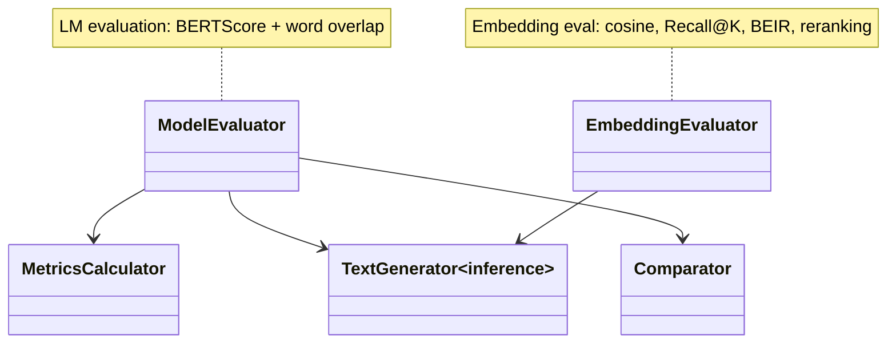

# Evaluation Subsystem

## Purpose

The evaluation subsystem computes quantitative metrics comparing model outputs against reference answers. It supports two evaluation modes: **LM evaluation** (BERTScore and word overlap on chat-format responses) and **embedding evaluation** (cosine similarity, Recall@K, BEIR benchmark, cross-encoder reranking). The subsystem provides both a programmatic API and a CLI interface (`commands/evaluate.py`) for workspace-scoped evaluation runs.

## Position in the System

Consumed by:
- **[cli-commands](cli-commands.md)** — `commands/evaluate.py` dispatches to `src/evaluation/evaluator.py` or `embedding_evaluator.py` based on `--method`
- **[tui](tui.md)** — EvaluationPanel and EmbeddingEvalPanel invoke evaluation and display results

Consumes:
- **[training](training.md)** — loaded models (base, LoRA adapters, fused)
- **[data](data.md)** — test data from the workspace

## Architecture

**ModelEvaluator** (`src/evaluation/evaluator.py`): The primary LM evaluation class. Loads models via `mlx_lm.load()` with adapter support through the public `adapter_path` parameter (replacing the broken `mlx_lm.tuner.linear_to_lora_layers` internal import). Provides:
- `load_model_with_adapters()` — loads base + LoRA at runtime using `load(base_model_path, adapter_path=adapter_path)`
- `evaluate_model()` — generates predictions, calculates metrics, returns results dict
- `comprehensive_model_comparison()` — evaluates base model vs runtime LoRA vs fused model in sequence, runs fusion quality verification

**MetricsCalculator** (`src/evaluation/metrics_calculator.py`): Computes two families of metrics:
- **Word overlap** — Jaccard similarity on lowercase word sets per prediction/reference pair, with mean/std/median/min/max aggregation
- **BERTScore** — Uses `evaluate` library's `bertscore` metric (optional dependency; gracefully degrades with a printed warning if unavailable); reports precision, recall, F1

**Comparator** (`src/evaluation/comparator.py`): Wraps `ModelEvaluator.compare_models()` for CLI use — sorts models by primary score and prints a ranked table with improvement analysis.

**EmbeddingEvaluator** (`src/evaluation/embedding_evaluator.py`): New module for embedding model evaluation:
- `compute_similarity()` — cosine similarity between anchor and candidate embeddings
- `recall_at_k()` — Recall@1/5/10 over `embedding_val.json`
- `run_beir()` — BEIR benchmark evaluation (NDCG@10, Recall@100); requires optional `beir` package
- `rerank_with_cross_encoder()` — reranks bi-encoder retrieval results using a cross-encoder

## Runtime Flows

1. **LM evaluation** (`ModelEvaluator.evaluate_model_from_path`):
   1. Load model (base or with adapters via `load_model_with_adapters()`)
   2. Load test data: parse JSON, split by `<|assistant|>` and `<|end|>` tags into questions and references
   3. Generate predictions via `mlx_lm.generate()` with configurable temperature and max tokens
   4. Calculate metrics via `MetricsCalculator.calculate_comprehensive_metrics()`
   5. Save results to `logs/evaluation/{model_name}_evaluation.json`

2. **Comprehensive comparison** (`ModelEvaluator.comprehensive_model_comparison`):
   1. Evaluate base model → `base_model` results
   2. Evaluate base + runtime LoRA adapters → `lora_runtime` results
   3. Evaluate fused model (if available) → `lora_fused` results
   4. Compare all models via `compare_models()` — sorted table with improvement percentage
   5. Fusion verification: compare runtime vs fused primary scores, classify quality (excellent <1%, good <3%, acceptable <5%, poor ≥5%)
   6. Save comprehensive results with timestamp to `logs/evaluation/comprehensive_comparison_{timestamp}.json`

3. **Embedding evaluation** (`EmbeddingEvaluator`):
   1. Load model via `FastEmbeddingModel.for_inference()` (optimized inference mode)
   2. Cosine similarity probe: user enters anchor + candidates, panel ranks by cosine similarity
   3. Retrieval metrics: Recall@1/5/10 over `embedding_val.json`
   4. BEIR benchmark: user selects datasets (SciFact, NFCorpus, MSMARCO-small), runs evaluation, displays NDCG@10
   5. Reranking: toggle cross-encoder reranking over retrieval results (if trained)

## Key Decisions

### Public `mlx_lm.load(adapter_path=...)` API for adapter loading
- **Decision:** Replace the broken `mlx_lm.tuner.linear_to_lora_layers` internal import with the public `mlx_lm.load(base_model_path, adapter_path=adapter_path)` API.
- **Context:** The original `load_model_with_adapters()` in `evaluator.py` used private internals that drifted out of sync. Both `src/training/` and `src/evaluation/` had this same broken import.
- **Alternatives rejected:** Maintaining a shim that patches internal APIs; implementing adapter loading from scratch.
- **Consequences:** Only `load_model_with_adapters()` in `evaluator.py` changed. The `adapter_config.json` file is no longer read by the evaluator — `mlx_lm.load()` reads it internally.
- **Ref:** 2026-06-26, Training Backend Refactor Design Spec §Evaluation fix

### Optional BERTScore dependency
- **Decision:** BERTScore is an optional dependency that gracefully degrades when the `evaluate` and `bert-score` packages are not installed.
- **Context:** BERTScore requires large model downloads (~2GB for the DeBERTa model). Users who only want word overlap should not be forced to install it.
- **Alternatives rejected:** Hard dependency (blocks lightweight installs); always computing BERTScore even when not wanted.
- **Consequences:** `MetricsCalculator` tries to import `evaluate` at init time; prints a note if unavailable. When BERTScore is unavailable, `calculate_comprehensive_metrics()` skips it and continues with word overlap only.
- **Ref:** 2026-06-26, config/evaluation_config.yaml; commit 4624a64

### Fusion quality verification via score delta thresholds
- **Decision:** After evaluating both runtime LoRA and fused models, the system classifies fusion quality based on the relative score difference: excellent <1%, good <3%, acceptable <5%, poor ≥5%.
- **Context:** Fusion (extracting LoRA weights and merging them into base model weights) must preserve the adapter's behavior. Without verification, silent degradation could go undetected.
- **Alternatives rejected:** Exact numerical comparison (would fail due to floating-point non-determinism); manual comparison (error-prone, not automated).
- **Consequences:** The comprehensive comparison output includes a clear quality classification. If fusion quality is poor, users should check the fusion process or adapter scale parameter.
- **Ref:** 2026-06-26, Training Backend Refactor Design Spec §Evaluation fix

### BEIR evaluation as optional heavy dependency
- **Decision:** BEIR benchmark evaluation requires the `beir` package (heavy install with multiple datasets), marked as optional in requirements.txt. The eval panel gracefully disables the BEIR section if `beir` is not importable.
- **Context:** BEIR provides standardized retrieval benchmarks but requires significant disk space and dependencies. Not all users need BEIR evaluation.
- **Alternatives rejected:** Bundling BEIR as a required dependency (excessive for LM-focused users); implementing custom benchmark (low reliability, maintenance burden).
- **Consequences:** BEIR section in the TUI eval panel shows an install prompt if `beir` is not available. When available, supports dataset selection (SciFact, NFCorpus, MSMARCO-small).
- **Ref:** 2026-06-30, Embedding Rename Design Spec §5

## Implementation Notes

- **Legacy Phi-3 format in evaluator:** `ModelEvaluator.load_test_data()` parses test data by splitting on `<|assistant|>` and `<|end|>` tokens (Phi-3 chat format). This is the format the test data is saved in, not a system prompt concern.
- **No BERTScore available:** `self.bertscore_available` is a boolean flag set at init. When False, `calculate_bertscore()` raises `ValueError` with a message, and `calculate_comprehensive_metrics()` catches the exception and sets `metrics['bertscore'] = None`.
- **EmbeddingEvaluator uses `for_inference()` mode:** `FastEmbeddingModel.for_inference(model)` is used before any inference call — this is an optimized inference mode from `mlx_tune` that is faster than `from_pretrained()` for evaluation.
- **BEIR requires `beir` package:** The `beir` package is listed as a commented-out optional dependency in `requirements.txt`. Installation is manual.
- **No PR or design doc records a rationale for the comprehensive model comparison automation; observed current state: the method exists in evaluator.py and provides base vs runtime vs fused comparison with fusion quality verification.**

## Source Anchors

- `src/evaluation/evaluator.py`
- `src/evaluation/metrics_calculator.py`
- `src/evaluation/comparator.py`
- `src/evaluation/embedding_evaluator.py`
- `src/inference/generator.py`
- `config/evaluation_config.yaml`
- `requirements.txt`
- `docs/superpowers/specs/2026-06-26-training-backend-refactor-design.md`
- `docs/superpowers/specs/2026-06-30-elixirtune-embedding-rename-design.md`

## Related Pages

- [training](training.md)
- [inference](inference.md)
- [data](data.md)
- [cli-commands](cli-commands.md)
- [tui](tui.md)
