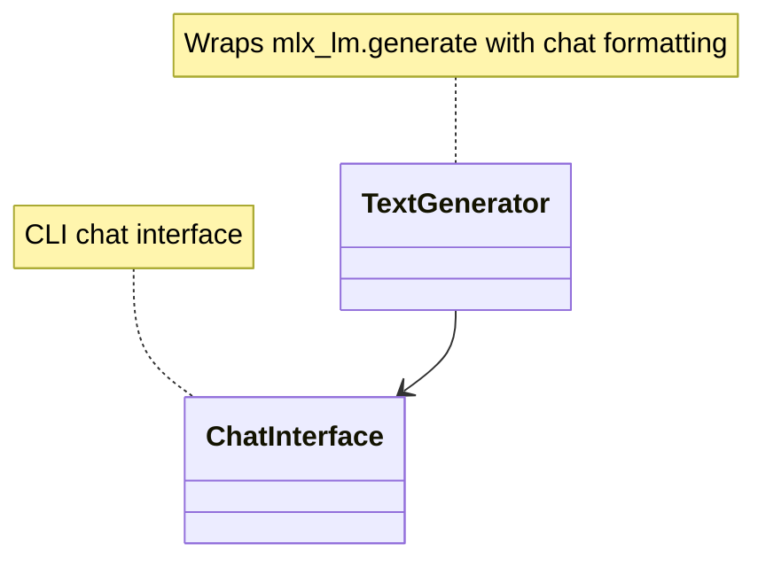

# Inference Subsystem

## Purpose

The inference subsystem provides text generation utilities for serving fine-tuned models. It wraps `mlx_lm.generate()` with chat-format prompt building, response cleaning, and conversation context support. The subsystem serves both the CLI `chat` command and the TUI chat panel, providing a consistent interface for interactive model interaction.

## Position in the System

Consumed by:
- **[cli-commands](cli-commands.md)** — `commands/chat.py` invokes inference to generate responses in the CLI
- **[tui](tui.md)** — TUI chat panel uses inference to generate responses interactively

Consumes:
- **[training](training.md)** — trained models (LoRA adapters, fused models)
- **[data](data.md)** — system prompt configuration

## Architecture

**TextGenerator** (`src/inference/generator.py`): The core inference class. Loads a model and tokenizer via `mlx_lm.load()`, then provides:
- `format_prompt()` — builds Phi-3 chat format strings with system prompt, user message, and assistant tag
- `generate_response()` — generates a single response with configurable max tokens and temperature, cleans the response
- `clean_response()` — extracts only the assistant content by splitting on `<|assistant|>` and `<|end|>` tags
- `batch_generate()` — generates responses to multiple messages sequentially
- `generate_with_context()` — generates responses with full conversation history (multi-turn)
- `get_model_info()` — returns model path, system prompt, and tokenizer vocab size

**ChatInterface** (`src/inference/chat_interface.py`): Provides a CLI chat interface that uses `TextGenerator`. Reads the system prompt and model path from the workspace config, then enters an interactive loop.

## Runtime Flows

1. **Single-turn generation** (`TextGenerator.generate_response`):
   1. Build formatted prompt via `format_prompt()` — Phi-3 chat format: `<|system|>\n{prompt}<|end|>\n<|user|>\n{message}<|end|>\n<|assistant|>`
   2. Call `mlx_lm.generate()` with the formatted prompt, max tokens, and temperature
   3. Clean response via `clean_response()` — split on `<|assistant|>` and `<|end|>` to extract only the assistant content
   4. Return cleaned response string

2. **Multi-turn generation** (`TextGenerator.generate_with_context`):
   1. Build conversation prompt: `<|system|>\n{system}<|end|>\n` followed by each message in history with appropriate tags
   2. Append the new user message with `<|user|>` tag
   3. Append `<|assistant|>` tag (prompt position for model to continue)
   4. Call `mlx_lm.generate()` and clean response

## Key Decisions

### Phi-3 chat format for all generation
- **Decision:** All prompts use Phi-3 chat template tokens (`<|system|>`, `<|user|>`, `<|assistant|>`, `<|end|>`) regardless of the underlying model.
- **Context:** The project was forked from `fine-tune-llm` which targets Phi-3 models. The training data format also uses Phi-3 chat format, so inference must produce compatible outputs.
- **Alternatives rejected:** Per-model chat templates (adds complexity; the fork already handles this); no system prompt support (less useful for domain-specific behavior).
- **Consequences:** Works well with Phi-3 and compatible models. Non-Phi-3 models may need their own chat template, but the current codebase does not address this.
- **Ref:** 2026-06-26, Training Backend Refactor Design Spec; commit 4624a64

### Response cleaning via tag splitting
- **Decision:** Generated responses are cleaned by splitting on `<|assistant|>` and `<|end|>` tokens to extract only the assistant content.
- **Context:** `mlx_lm.generate()` may produce output that includes the prompt tokens or additional assistant continuations beyond the intended response.
- **Alternatives rejected:** Token-based stopping (requires knowing the stop token); length-based truncation (fragile, cuts valid responses).
- **Consequences:** The clean response always starts after the first `<|assistant|>` token and ends before the first `<|end|>` token. If the model produces multiple `<|assistant|>` or `<|end|>` sequences, only the first segment is kept.
- **Ref:** 2026-06-26, Training Backend Refactor Design Spec

## Implementation Notes

- **Model loading is eager:** `TextGenerator.__init__()` calls `mlx_lm.load()` immediately — if the model path is invalid, initialization fails. There is no lazy loading.
- **Batch generation is sequential:** `batch_generate()` processes messages one at a time, not in parallel. This is simple but not optimized for throughput.
- **No streaming support:** `mlx_lm.generate()` supports streaming in some configurations, but the current code does not use it. All responses are returned as complete strings.
- **ChatInterface reads from workspace config:** The CLI chat command reads the model path and system prompt from the workspace configuration, making it domain-aware.
- **Legacy Phi-3 format:** The chat format is hardcoded to Phi-3 tokens. There is no mechanism to switch to other chat templates (e.g., Llama 3, Mistral). If the project trains on non-Phi-3 models, this would need extension.
- **No PR or design doc records a rationale for the clean_response tag-splitting approach; observed current state: the method exists in generator.py and has been consistent since the fork.**

## Source Anchors

- `src/inference/generator.py`
- `src/inference/chat_interface.py`
- `commands/chat.py`
- `docs/superpowers/specs/2026-06-26-training-backend-refactor-design.md`

## Related Pages

- [training](training.md)
- [cli-commands](cli-commands.md)
- [data](data.md)
- [evaluation](evaluation.md)
- [tui](tui.md)
