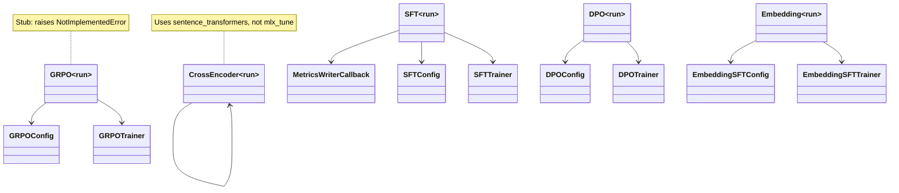

# Training Subsystem

## Purpose

The training subsystem provides the model optimization backends for ElixirTune, covering four training paradigms: **SFT** (supervised fine-tuning with LoRA), **DPO** (direct preference optimization), **embedding fine-tuning** (bi-encoder and cross-encoder), and **GRPO** (group relative policy optimization, currently a stub). All training is backed by `mlx_tune`, which provides a stable, Unsloth-compatible API that absorbs `mlx_lm` internal churn. A shared `MetricsWriterCallback` writes training metrics to JSON for real-time TUI polling.

## Position in the System

Consumed by:
- **[cli-commands](cli-commands.md)** — `commands/train.py` dispatches to the appropriate training module based on `--method`
- **[tui](tui.md)** — TUI panels (TrainingPanel, EmbeddingTrainingPanel) invoke `commands/train.py` and poll `logs/training/training_metrics.json`

Consumes:
- **[data](data.md)** — `processed/train.json`, `processed/dpo.json`, `processed/embedding_train.json`
- **[config](config.md)** — `model_config.yaml` (base model, LoRA params, embedding block) and `training_config.yaml` (iterations, batch size, method)

## Architecture

All training modules share a common signature: `run(domain, model_config_path, training_config_path, train_data_path, val_data_path)` where the domain determines workspace paths and config blocks. The modules load configs via a shared `_load_configs()` helper pattern and dispatch to `mlx_tune` trainers.

**SFT** (`src/training/sft.py`): Loads base model via `FastLanguageModel.from_pretrained()`, wraps with `FastLanguageModel.get_peft_model()` for LoRA, loads dataset via `Dataset.from_list()`, and trains with `SFTTrainer`. Metrics are written by `MetricsWriterCallback` to `workspaces/{domain}/logs/training/training_metrics.json` — the TUI polls this file every 2 seconds.

**DPO** (`src/training/dpo.py`): Validates that training data has `{prompt, chosen, rejected}` fields before loading. By default, continues from the SFT-fused model (`workspaces/{domain}/fused/`); set `dpo.from_base: true` in training config to train from the original base model instead. Uses `DPOTrainer` from `mlx_tune`. No eval dataset is supported by `DPOTrainer`.

**Embedding** (`src/training/embedding.py`): Uses `mlx_tune.embeddings.FastEmbeddingModel` and `EmbeddingSFTTrainer`. Reads the `embedding` block from both model and training configs. Supports `infonce` and `triplet` loss types, configurable pooling strategy (`mean`, `cls`, `last_token`), and negative column for triplet training.

**GRPO** (`src/training/grpo.py`): Validates data has a `{prompt}` field, then raises `NotImplementedError` — the reward function and full pipeline are not yet configured.

**Cross-encoder** (`src/training/cross_encoder.py`): Uses `sentence_transformers.CrossEncoder` (not `mlx_tune`). Builds `(query, doc, label)` pairs from anchor/positive/negative columns, trains with `CEBinaryAccuracyEvaluator` for validation. Output goes to `workspaces/{domain}/ce_adapters/`.

**MetricsWriterCallback** (`src/training/metrics_writer.py`): A `transformers.TrainerCallback` that intercepts `on_log` events, extracts `loss` and `eval_loss`, appends to `{"train_loss": [], "val_loss": [], "iterations": []}`, and writes to JSON on each step. Creates the directory and file on first write.

## Runtime Flows

1. **SFT training** (`sft.py:run`):
   1. Load model config and training config via `_load_configs()`
   2. `FastLanguageModel.from_pretrained()` loads the base model
   3. `FastLanguageModel.get_peft_model()` applies LoRA (rank, keys, alpha, dropout from config)
   4. Load train/val datasets from JSON via `Dataset.from_list()`
   5. Configure `SFTConfig` with output dir, batch size, learning rate, max steps, eval steps
   6. Instantiate `SFTTrainer` with `MetricsWriterCallback`, call `trainer.train()`
   7. Adapters saved to `workspaces/{domain}/adapters/`

2. **DPO training** (`dpo.py:run`):
   1. Validate training data has `{prompt, chosen, rejected}` fields (raises `ValueError` if not)
   2. Determine base: SFT-fused model if `workspaces/{domain}/fused/` exists and `dpo.from_base` is falsy; otherwise base model
   3. Load model, apply LoRA via `get_peft_model()`
   4. Load training data, configure `DPOConfig` (beta from config, default 0.1)
   5. Instantiate `DPOTrainer`, call `trainer.train()` — streams progress to stdout for TUI log view
   6. Adapters saved to `workspaces/{domain}/adapters/` (same path as SFT; DPO LoRA replaces SFT LoRA)

3. **Embedding training** (`embedding.py:run`):
   1. Load configs, read `embedding` blocks from both
   2. `FastEmbeddingModel.from_pretrained()` with pooling strategy
   3. `FastEmbeddingModel.get_peft_model()` for LoRA
   4. Configure `EmbeddingSFTConfig` with loss type, temperature, margin, normalize, anchor/positive/negative columns
   5. Train with `EmbeddingSFTTrainer`
   6. Adapters saved to `workspaces/{domain}/adapters/`

## Key Decisions

### mlx-tune as the unified training backend
- **Decision:** Replace the broken `mlx_lm.tuner` internal imports with `mlx_tune` for all training paradigms.
- **Context:** The original `src/training/` module imported `linear_to_lora_layers` and `TrainingArgs` from `mlx_lm.tuner`, which drifted out of sync with the API. Neither was callable.
- **Alternatives rejected:** Maintaining custom wrappers around `mlx_lm.tuner` internals (brittle, requires tracking API drift); implementing DPO/GRPO from scratch (out of scope).
- **Consequences:** `mlx_tune` pins `mlx_lm` as a dependency, absorbs internal churn, and provides a stable Unsloth-compatible API. All three training methods (SFT, DPO, GRPO) are covered.
- **Ref:** 2026-06-26, Training Backend Refactor Design Spec; commit 4624a64

### DPO continues from SFT-fused by default
- **Decision:** DPO trains from the SFT-fused weights by default (`workspaces/{domain}/fused/`), not from the base model.
- **Context:** The standard SFT→DPO pipeline applies preference optimization on top of already-tuned weights. `mlx_tune` cannot load an existing adapter into a fresh LoRA, so the SFT-fused weights are the only viable starting point.
- **Alternatives rejected:** Always starting from base (loses SFT tuning); supporting adapter chaining (not possible with current `mlx_tune` API).
- **Consequences:** Users must run SFT then Fuse before DPO. The `dpo.from_base: true` config override allows training from base when the SFT path is not desired.
- **Ref:** 2026-07-01, commit 587076c

### MetricsWriterCallback for TUI real-time polling
- **Decision:** Training metrics are written to a shared JSON file (`logs/training/training_metrics.json`) that the TUI polls every 2 seconds.
- **Context:** The TUI needs real-time training visibility (loss curves, iterations) but runs the training as a subprocess — it cannot inject a callback directly.
- **Alternatives rejected:** TUI intercepting subprocess stdout (fragile); WebSocket or HTTP server (adds infrastructure for a single polling use case).
- **Consequences:** The TUI's TrainingPanel reads this file in a background thread. The callback creates the directory on first write.
- **Ref:** 2026-06-26, Training Backend Refactor Design Spec §Architecture

### Cross-encoder uses sentence_transformers, not mlx_tune
- **Decision:** The cross-encoder training module uses `sentence_transformers.CrossEncoder` (PyTorch-based) instead of an MLX-native alternative.
- **Context:** `mlx_tune` provides embedding training via `FastEmbeddingModel` but no cross-encoder equivalent. `sentence_transformers` has mature cross-encoder training with `CEBinaryAccuracyEvaluator`.
- **Alternatives rejected:** Waiting for mlx-tune cross-encoder support (may never come); implementing from scratch (high effort, low value for a secondary training path).
- **Consequences:** Cross-encoder training requires PyTorch (`torch`) in addition to MLX dependencies. Output goes to `ce_adapters/` in the workspace.
- **Ref:** 2026-06-30, Embedding Rename Design Spec §3

### Embedding domain type system
- **Decision:** Each domain's `config.yaml` gains a `type` field (`lm` or `embedding`), with embedding domains having a separate status ladder and data format.
- **Context:** Embedding fine-tuning requires different data formats (anchor/positive/negative triples), different training loops, and a different evaluation pipeline — mixing them with LM domains would create confusing conditionals everywhere.
- **Alternatives rejected:** Single domain type with conditional logic everywhere; separate repo per domain type.
- **Consequences:** The TUI and commands branch on domain type; existing domains default to `lm` (backward compatible).
- **Ref:** 2026-06-30, Embedding Rename Design Spec §2

### DPO data format validation at startup
- **Decision:** DPO validates the preference-data contract (`{prompt, chosen, rejected}`) before importing the heavy `mlx_tune` backend.
- **Context:** A misconfigured DPO run would otherwise fail deep inside `DPOTrainer` with an opaque error.
- **Alternatives rejected:** Letting the trainer fail with a cryptic error; validating at the data preparation stage only (the training module should also guard).
- **Consequences:** Clear `ValueError` with a message explaining the required format. The DPO module contains the full trainer setup behind the format check — it is not an empty stub.
- **Ref:** 2026-06-29, commit 4187386

## Implementation Notes

- **GRPO is a stub:** `src/training/grpo.py` validates data has a `{prompt}` field but raises `NotImplementedError` — the reward function and full pipeline are not yet configured. No PR or design doc records a rationale for why GRPO was left as a stub; observed current state: the module exists to reserve the training method slot and validate data shape.
- **MetricsWriterCallback uses `transformers.TrainerCallback`:** Despite `mlx_tune` being the training backend, `MetricsWriterCallback` inherits from `transformers.TrainerCallback` (not an MLX-native callback). This works because `mlx_tune`'s `SFTTrainer` internally uses the HuggingFace `Trainer` protocol.
- **DPO and SFT share the same adapter output path:** Both save to `workspaces/{domain}/adapters/`. DPO LoRA replaces the SFT LoRA — to revert, re-fuse from the SFT adapters.
- **DPO has no eval dataset:** `DPOTrainer` in `mlx_tune` does not support `eval_dataset`; the `val_data_path` parameter is accepted but ignored.
- **Cross-encoder num_epochs heuristic:** Cross-encoder uses `max(1, int(t_cfg.get("iters", 100)) // 10)` to derive epochs from the embedding training config's `iters` — a heuristic mapping, not a direct config value.
- **`src/_compat.py` is imported in all training modules:** This applies Python 3.14 / `datasets` compatibility patches. Without it, imports would fail on newer Python versions.

## Source Anchors

- `src/training/sft.py`
- `src/training/dpo.py`
- `src/training/embedding.py`
- `src/training/grpo.py`
- `src/training/cross_encoder.py`
- `src/training/metrics_writer.py`
- `src/evaluation/evaluator.py`
- `src/evaluation/metrics_calculator.py`
- `src/inference/generator.py`
- `config/model_config.yaml`
- `config/training_config.yaml`
- `docs/superpowers/specs/2026-06-26-training-backend-refactor-design.md`
- `docs/superpowers/specs/2026-06-30-elixirtune-embedding-rename-design.md`

## Related Pages

- [data](data.md)
- [cli-commands](cli-commands.md)
- [evaluation](evaluation.md)
- [inference](inference.md)
- [tui](tui.md)
- [config](config.md)
