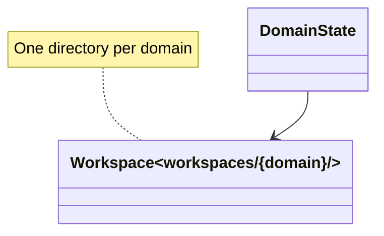

# Workspaces

## Purpose

The workspace system provides a **per-domain directory structure** that stores all artifacts for a single fine-tuning domain — configs, data, models, logs, and adapters. Each workspace is a self-contained unit that can be created, inspected, and deleted independently. The workspace layout is consistent across all domains and is understood by both the CLI commands and the TUI panels.

## Position in the System

Consumed by:
- **[cli-commands](cli-commands.md)** — all commands resolve workspace paths via `_ws(domain)`
- **[tui](tui.md)** — scans workspaces to list domains, generates runtime configs per workspace
- **[data](data.md)** — pipeline stages read/write workspace directories (seeds, generated, processed, runs)
- **[training](training.md)** — training outputs go to workspace (adapters, logs)

Consumes:
- **[config](config.md)** — workspace configs (`config.yaml`, `runtime_config.yaml`)

## Architecture



**DomainState** (`tui/domain.py`): A dataclass representing a domain's state:
- `name: str` — domain name (directory name)
- `workspace: Path` — full workspace path
- `status: Status` — current pipeline stage

**Workspace directory layout:**

```
workspaces/{domain}/
  config.yaml              # Domain-specific config overrides
  description.txt           # Domain description (bootstrap input)
  runtime_model_config.yaml       # Generated: model config with workspace paths
  runtime_training_config.yaml    # Generated: training config with workspace paths
  runtime_eval_config.yaml        # Generated: evaluation config with workspace paths
  seeds/
    candidates.jsonl       # Raw bootstrapped/imported seeds (pre-curation)
    approved.jsonl         # Post-curation trusted seeds
  generated/
    raw.jsonl              # Generate stage output
    refined.jsonl          # After refine passes
    filtered.jsonl         # Survivors of all 4 filters
    topics.txt             # Planned topics for diversity steering
  runs/
    <timestamp>/           # One dir per generate run
      manifest.json        # Resolved config, teacher, seed hash, counts
      rejected.jsonl       # Dropped records with reasons
      stats.json           # Diversity coverage, counts, judge distribution
  processed/
    train.json             # Training data (train split)
    val.json               # Validation data
    test.json              # Test data
    dpo.json               # DPO preference pairs (prompt, chosen, rejected)
    embedding_train.json   # Embedding training data
    embedding_val.json     # Embedding validation data
    data_stats.json        # Data statistics (train/val/test sizes)
  adapters/
    adapter_config.json    # LoRA adapter configuration
    *.safetensors          # Adapter weights
    adapters/              # Nested adapters dir (mlx_tune SFTTrainer saves here)
  fused/
    *.safetensors          # Fused model weights (base + LoRA merged)
  ce_adapters/             # Cross-encoder adapters
  logs/
    training/
      training_metrics.json # Training loss/iteration metrics (TUI polling)
    evaluation/
      {model}_evaluation.json  # Evaluation results
      comprehensive_comparison_{timestamp}.json  # Model comparison
```

**Domain type:** Each workspace has a `type` field in `config.yaml` (`lm` or `embedding`). This determines which panels the TUI shows and which status ladder is used.

**Status inference:** `tui/domain.py:infer_status()` determines a domain's pipeline stage by checking file existence in a specific order:

**LM status ladder:** `EMPTY → SEEDED → GENERATED → PREPARED → TRAINED → EVALUATED → DEPLOYED`

| Status | Check |
|--------|-------|
| `DEPLOYED` | `fused/` exists and has files |
| `EVALUATED` | `logs/evaluation/` has `*_evaluation.json` files |
| `TRAINED` | `adapters/` exists and has files |
| `PREPARED` | `processed/train.json` exists |
| `GENERATED` | `generated/filtered.jsonl` exists |
| `SEEDED` | `seeds/approved.jsonl` exists |
| `EMPTY` | Default (nothing exists) |

**Embedding status ladder:** `EMPTY → DATA_READY → PREPARED → TRAINED → CE_TRAINED`

| Status | Check |
|--------|-------|
| `CE_TRAINED` | `ce_adapters/` exists and has files |
| `TRAINED` | `adapters/` exists and has files |
| `PREPARED` | `processed/embedding_train.json` exists |
| `DATA_READY` | `data/raw/` has files OR `seeds/approved.jsonl` exists |
| `EMPTY` | Default |

**Adapter directory resolution:** `tui/domain.py:resolve_adapters_dir()` handles the fact that `mlx_tune`'s `SFTTrainer` saves adapters under `workspaces/{domain}/adapters/adapters/` (nested), not directly under `adapters/`. The function checks for `adapter_config.json` in the nested path first, then falls back to the direct path.

## Runtime Flows

1. **Domain creation:**
   1. TUI `NewDomainScreen` collects name, description, model, and type
   2. Creates `workspaces/{domain}/` directory
   3. Writes `config.yaml` with `type`, `teacher`, and other settings
   4. Writes `description.txt` with domain description
   5. Generates runtime configs via `generate_runtime_configs()`

2. **Domain scanning:**
   1. TUI calls `scan_domains(root)` to list all domains
   2. Iterates over `workspaces/` directory, filtering subdirectories
   3. For each domain, calls `infer_status(ws)` to determine pipeline stage
   4. Returns list of `DomainState` objects

3. **Workspace path resolution:**
   1. CLI commands call `_ws(domain)` from `commands/__init__.py`
   2. Returns `Path("workspaces") / domain`
   3. All file paths are derived from this base

## Key Decisions

### One directory per domain
- **Decision:** Each fine-tuning domain gets its own workspace directory under `workspaces/`, containing all its artifacts.
- **Context:** The project uses a "workspace-per-domain" model, making each domain self-contained and independently manageable.
- **Alternatives rejected:** Single shared directory with subdirectories per domain (makes deletion harder, less isolated); separate top-level directories (harder to discover and manage).
- **Consequences:** Deleting a domain is a single directory removal. All artifacts for a domain are in one place.
- **Ref:** 2026-06-26, Training Backend Refactor Design Spec

### File-existence-based status inference
- **Decision:** A domain's pipeline stage is inferred from the existence of specific files/directories, not from a versioned state file.
- **Context:** The pipeline stages are naturally marked by file outputs (seeds generated → `approved.jsonl`, data prepared → `train.json`, etc.). Using file existence avoids a separate state tracking system.
- **Alternatives rejected:** Explicit state file (e.g., `workspaces/{domain}/.status`) — adds a file to maintain; state machine with transitions — overengineered for the use case.
- **Consequences:** Status is always current (no stale state file to sync). But it means the status check reads the filesystem on each TUI render.
- **Ref:** 2026-06-26, commit 4624a64; 2026-06-30, Embedding Rename Design Spec §2

### Nested adapters directory handling
- **Decision:** `resolve_adapters_dir()` checks for `adapters/adapters/adapter_config.json` first, falling back to `adapters/adapter_config.json`.
- **Context:** `mlx_tune`'s `SFTTrainer` saves adapters under `{output_dir}/adapters/`, and the output_dir is already `workspaces/{domain}/adapters/`, resulting in a nested `adapters/adapters/` path.
- **Alternatives rejected:** Changing the output_dir to account for the nesting (would require knowing the trainer's internal behavior); ignoring the nesting (breaks adapter loading).
- **Consequences:** The function correctly finds adapter files regardless of the nesting. The TUI reads adapter config from the correct location.
- **Ref:** 2026-06-26, Training Backend Refactor Design Spec; commit 4624a64

## Implementation Notes

- **Workspace directory is not created automatically:** `scan_domains()` returns an empty list if `workspaces/` doesn't exist. Domains must be created via the TUI or CLI `init` command.
- **No PR or design doc records a rationale for the status inference file-existence approach; observed current state: `infer_status()` checks file existence in order, with no separate state tracking mechanism.**
- **Embedding workspace uses `data/raw/` for raw data import:** The embedding status ladder checks for `data/raw/` directory (not `generated/`), as embedding data is imported directly rather than generated synthetically.
- **Runtime configs are not part of the canonical workspace layout:** `runtime_model_config.yaml`, `runtime_training_config.yaml`, and `runtime_eval_config.yaml` are generated files, not tracked in git or listed in `.gitignore`. They are created on-demand by the TUI.
- **`workspaces/` is listed in `.gitignore`:** The workspace directory contains user-specific data (configs, models, adapters) and should never be committed.

## Source Anchors

- `tui/domain.py`
- `commands/__init__.py`
- `tui/new_domain.py`
- `tui/delete_domain.py`
- `config/defaults.yaml`
- `docs/superpowers/specs/2026-06-26-training-backend-refactor-design.md`
- `docs/superpowers/specs/2026-06-30-elixirtune-embedding-rename-design.md`

## Related Pages

- [cli-commands](cli-commands.md)
- [tui](tui.md)
- [data](data.md)
- [config](config.md)
